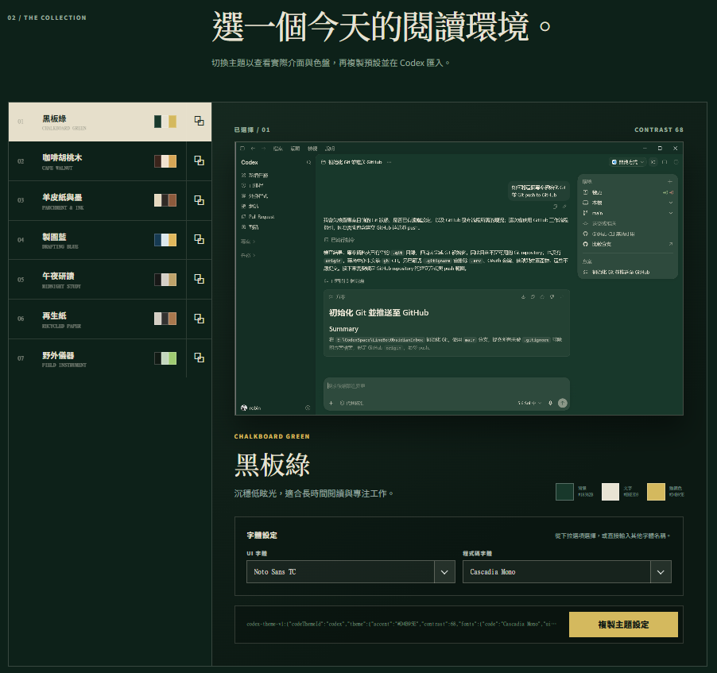

# Codex Material Themes

Example site: https://codex-material-themes.bud4net.chatgpt.site/

A static website for previewing and copying seven Codex material themes.
It uses plain HTML, CSS, and browser JavaScript—there is no React, database,
login, or application server.

## 安裝 Codex Skill

在 Codex 對話中輸入：

```text
請安裝 Skill：
https://github.com/robinli/codex-material-themes/tree/main/.agents/skills/choose-codex-theme
```



## Edit the site

- `index.html`: page metadata and the HTML entry point.
- `public/site.js`: theme data, Chinese/English text, language switching, theme
  selection, and copy-to-clipboard interaction.
- `public/site.css`: layout and visual styling.
- `public/themes/`: the seven preview images.

## Run locally

```powershell
npm install
npm run dev
```

## Build and publish

```powershell
npm run build
```

The browser files are generated in `dist/client`. `dist/server` contains only a
small Sites-compatible entry point that forwards requests to those static files.
Both folders are deployment output and are ignored by Git.
